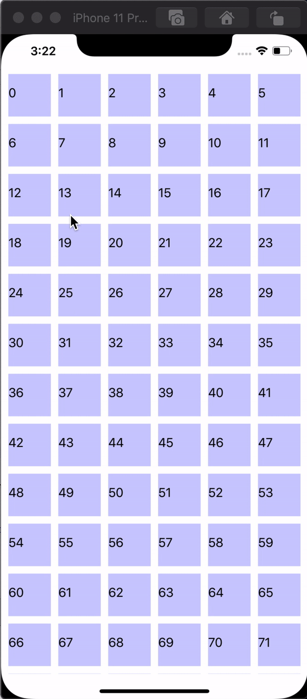

# UGrid

[](https://travis-ci.org/semerjyan.aram@gmail.com/ugrid)
[](https://cocoapods.org/pods/ugrid)
[](https://cocoapods.org/pods/ugrid)
[](https://cocoapods.org/pods/ugrid)

## Example

To run the example project, clone the repo, and run `pod install` from the Example directory first.

## Features
UGrid offers three different sizes for cells. Toggle between them and let UGridFlowLayout to hanlde the rest. All empty spaces will be used. UGridView is willing to be like Windows Phone home page grid view :)



## Implementation
Just assign instance of `UGridFlowLayout` to your collection view's `collectionViewLayout` property and you're good to go. If you want to toggle between size

#### Toggle between sizes
Just call `toggleSize(forIndexPath:)` On `UGridFlowLayout` instance. Layout will automaticall toggle between small, middle and big sizes.

#### Store changes
For simplicity `UserDefaults` is used to save size for each cell index path. If you still want to handle storing by yourself You want to check [this section](####-Change-behaviour)

#### Change behaviour
UGrid is still in development. It do it's best to bring the fastest calculation time for reordering cells, simplest implementation and usability. Though if you have a better calculation idea (which is most likely) you can create your own calculation class by simply adopting to `IGridCalculation` protocol and use `setCalculationLogic(_:)` on `UGridFlowLayout` instance to change calculation logic.
Also if you like to store sizes on your own, you can adopt to `IGridSizeRepository` protocol and set new storing mechanism by calling `setSizeRepository(_:)` on on `UGridFlowLayout` instance.

## What is planned to be done
* Support for horizontal scroll direction. Currently only vertical is supported
* Section support. Currently only one section is supported
* Drag and Drop support

## Requirements
* XCode 11+
* iOS 11+

## Installation

ugrid is available through [CocoaPods](https://cocoapods.org). To install
it, simply add the following line to your Podfile:

```ruby
pod 'ugrid'
```

## Author

Bug Creator

## License

ugrid is available under the MIT license. See the LICENSE file for more info.
